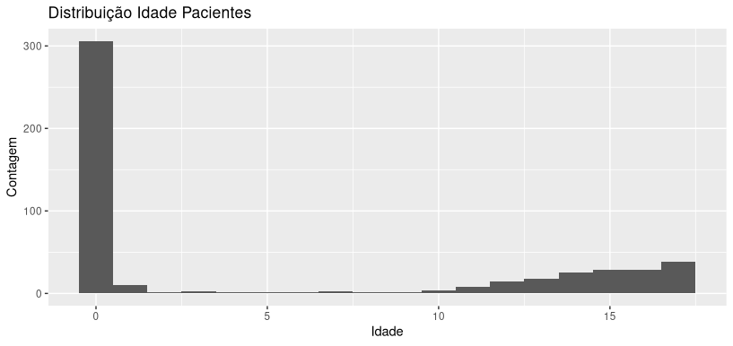
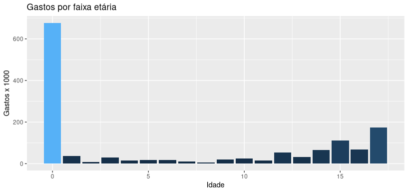

# Análise de Dados Hospitalares em R
Mini projeto proposto pela [Data Science Academy](https://www.datascienceacademy.com.br).

> Curso Big Data Analytics com R e Microsoft Azure Machine Learning 3.0

#### Estudo Proposto
  Uma rede de hospitais gostaria de compreender as variáveis relacionadas aos gastos com internações hospitalares de pacientes.

  Usaremos dados de uma pesquisa nacional de custos hospitalares realizada pela US Agency for Healthcare que consiste em registros hospitalares de amostras de pacientes internados. Os dados fornecidos são restritos à cidade de Wisconsin e referem-se a pacientes na faixa etária de 0 a 17 anos. 

  Vamos separar o trabalho em duas etapas. Na etapa 1 vamos explorar os dados usando Linguagem SQL e responder 10 perguntas de negócio. Na etapa 2 vamos realizar análise estatística com Linguagem R através do Teste ANOVA e Regressão Linear e responder 7 perguntas de negócio. 

##### Fonte de dados
- [CMS](https://www.cms.gov/Research-Statistics-Data-and-Systems/Statistics-Trends-and-Reports/Medicare-Provider-Cost-Report/HospitalCostPUF)
- [Healthdata](https://healthdata.gov/)


#### Dicionário de dados

|Atributo|Descrição|
|--------|---------|
|AGE|Idade do paciente|
|FEMALE|Variável binária que indica se o paciente é do sexo feminino|
|LOS|Tempo da internação do paciente|
|RACE|Grupo étnico do paciente|
|TOTCHG|Custo da internação|
|APRDRG|Grupo de diagnóstico refinado do paciente|

---
### SQL - ANÁLISE EXPLORATÓRIA


##### Questões a serem respondidas:

1. Quantas raças estão representadas no dataset?
```{.R}
      sqldf('SELECT RACE, COUNT(RACE) AS NUM_RACE
            FROM dados
            GROUP BY RACE') 
```


2. Qual a idade média dos pacientes?
```{.R}
      sqldf('SELECT AVG(age) AS idade_media
            FROM dados')
```


3. Qual a moda da idade dos pacientes?
```{.R}
      sqldf("SELECT AGE AS Idade_moda FROM
            (SELECT AGE, COUNT(AGE) AS age_count FROM dados
            GROUP BY AGE
            ORDER BY AGE_COUNT DESC)
            LIMIT 1")
```


4. Qual a variância da coluna idade?
```{.R}
      sqldf(
        'SELECT
        SUM(
        POWER(
        AGE - (SELECT AVG(AGE) FROM dados)
        ,2)) /
        (COUNT(AGE) - 1)
        AS variancia
        FROM dados')
```


5. Qual o gasto total com internações hospitalares por idade?
```{.R}
      gasto_hosp <- sqldf(
        'SELECT AGE AS idade, 
        SUM(TOTCHG) AS gastos
        FROM dados
        GROUP BY AGE')
```


6. Qual idade gera o maior gasto total com internações hospitalares?
```{.R}
      sqldf(
        'SELECT AGE, MAX(GASTOS_IDADE)
        AS MAIOR_GASTO
        FROM gasto_hosp')

```


7. Qual o gasto total com internações hospitalares por gênero?
```{.R}
      sqldf(
        'SELECT FEMALE, SUM(TOTCHG)
        AS gasto_total
        FROM dados
        GROUP BY FEMALE')
```


8. Qual a média de gasto com internações hospitalares por raça do paciente?
```{.R}
      sqldf(
        'SELECT RACE AS gênero,
        AVG(TOTCHG) AS média_gasto
        FROM dados
        GROUP BY RACE')
```


9. Para pacientes acima de 10 anos, qual a média de gasto total com internações hospitalares?
```{.R}
      gasto_maior_10 <- sqldf(
        'SELECT AGE AS idade,
        AVG(TOTCHG) AS média_gastos
        FROM dados
        WHERE AGE > 10
        GROUP BY AGE')
```


10. Considerando o item anterior, qual idade tem média de gastos superior a 3000?
```{.R}
      sqldf(
        'SELECT AGE AS idade,
        AVG(TOTCHG) AS média_gastos
        FROM dados
        WHERE AGE > 10
        GROUP BY AGE
        HAVING AVG(TOTCHG) > 3000')
```
---
### Análise de Regressão em R

1. Qual a distribuição da idade dos pacientes que frequentam o hospital?
```{.R}
      ggplot(dados, aes(AGE)) +
        ggtitle('Distribuição Idade Pacientes') +
        geom_histogram(binwidth = 1) +
        xlab('Idade') +
        ylab('Contagem')
```


2. Qual faixa etária tem o maior gasto total no hospital?
```{.R}
      ggplot(gasto_hosp, aes(x=idade, y=gastos / 1000)) +
        ggtitle('Gastos por faixa etária') +
        geom_col(aes(fill = gastos / 1000)) +
        xlab('Idade') +
        ylab('Gastos x 1000') +
        scale_y_continuous() +
        theme(legend.position = "none")
```
  Convertendo para fator temos a quantidade de pacientes por idade.
```{.R}
      summary(as.factor(dados$AGE))
```



3. Qual grupo baseado em diagnóstico (APRDRG) tem o maior gasto total no hospital?
```{.R}
      gasto_baseado_APRDRG <- dados %>% 
        aggregate(TOTCHG ~ APRDRG, FUN = 'sum')
        
      gasto_baseado_APRDRG[which.max(gasto_baseado_APRDRG$TOTCHG), ]
```


4. A característica étnica do paciente tem relação com o total gasto em internações no hospital?

    Variável dependente no Teste ANOVA: **TOTCHG** \
    Variável independente no Teste ANOVA: **RACE**


- **H0**: Não há efeito de RACE em TOTCHG.
- **H1**: Há efeito de RACE em TOTCHG.

```{.R}
    mod_anova_race <- aov(TOTCHG ~ RACE, data = dados)
    summary(mod_anova_race)
    mod_anova_race
```
O **valor-p é maior** que 0.05. Falhamos em rejeitar a H0.

A característica étnica do paciente **não influencia** no gasto total com internação hospitalar.


5. A combinação de idade e gênero dos pacientes influência no gasto total em internações no hospital?

      Novamente usei um Teste ANOVA. \
      Variável dependente no Teste ANOVA: **TOTCHG** \
      Variáveis independentes no Teste ANOVA: **AGE**, **FEMALE**

- **H0**: Não há efeito de AGE e FEMALE em TOTCHG.
- **H1**: Há efeito de AGE e FEMALE em TOTCHG.

```{.R}
      mod_anova_idade_gen <- aov(TOTCHG ~ AGE + FEMALE, data = dados)
      summary(mod_anova_idade_gen)
```
Em ambos os casos o **valor-p é menor** que 0.05. Rejeitamos a hipótese nula. 
**Há um efeito significativo da idade e do gênero** nos custos hospitalares.


6. Como o tempo de permanência é o fator crucial para pacientes internados, desejamos descobrir se o tempo de permanência pode ser previsto a partir de idade, gênero e raça.

      Variável dependente: **LOS** \
      Variáveis independentes: **AGE**, **FEMALE** e **RACE** 

- **H0**: Não há relação linear entre variáveis dependente e independentes.
- **H1**: Há relação linear entre variáveis dependente e independentes.
```{.R}
      mod_lm <- lm(LOS ~ AGE + FEMALE + RACE, dados)
      summary(mod_lm)
```
Valor-p *maior que 0.05* em todos os casos, logo, falhamos em rejeitar a H0.
O tempo de internação *não pode ser previsto* a partir das variáveis independentes usadas.


7. Quais variáveis têm maior impacto nos custos de internação hospitalar?

      Variável dependente: **TOTCHG** \
      Variáveis independentes: **AGE**, **FEMALE**, **LOS**, **RACE** e **APRDRG**

- **H0**: Não há relação linear entre variáveis dependente e independentes.
- **H1**: Há relação linear entre variáveis dependente e independentes.

```{.R}
      mod_lm_custo <- lm(TOTCHG ~ . , dados)
      summary(mod_lm_custo)
```
Como podemos observar a partir dos valores dos coeficientes, as variáveis idade, tempo de permanência (LOS) e grupo de diagnóstico refinado do paciente (APRDRG), são os únicos com significância estatística. \
Sendo que RACE não é significativa. Então vou removê-la do modelo.
```{.R}
      mod_lm_custo_v4 <- lm(TOTCHG ~ AGE + LOS + APRDRG + FEMALE, dados)
      summary(mod_lm_custo_v4)
```

A variável FEMALE também não é significativa. \
Sendo vou removê-la também.
```{.R}
      mod_lm_custo_v3 <- lm(TOTCHG ~ AGE + LOS + APRDRG, dados)
      summary(mod_lm_custo_v3)
```
As 3 variáveis tem alta significância, mas APRDRG tem valor t negativo. \
Vamos ver como se comporta removendo.`
```{.R}
      mod_lm_custo_v2 <- lm(TOTCHG ~ AGE + LOS, dados)
      summary(mod_lm_custo_v2)
```
- A remoção de raça e gênero não altera o valor de R2.
- A remoção do APRDRG no modelo aumenta o erro padrão. 
Logo, o modelo mod_lm_custo_v3 parece ser o melhor e o usaremos para nossa conclusão.
```{.R}
      summary(mod_lm_custo_v3)
```
Conclusão:

`Como ficou evidente nos vários modelos acima, os custos dos cuidados de saúde dependem da idade, do tempo de permanência e do grupo de diagnóstico.
Essas são as 3 variáveis mais relevantes para explicar e prever o gasto com internações hospitalares.`

---
Roberto Balbinotti - rbalbinotti@gmail.com - 51-92001-8268
